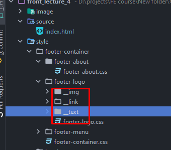
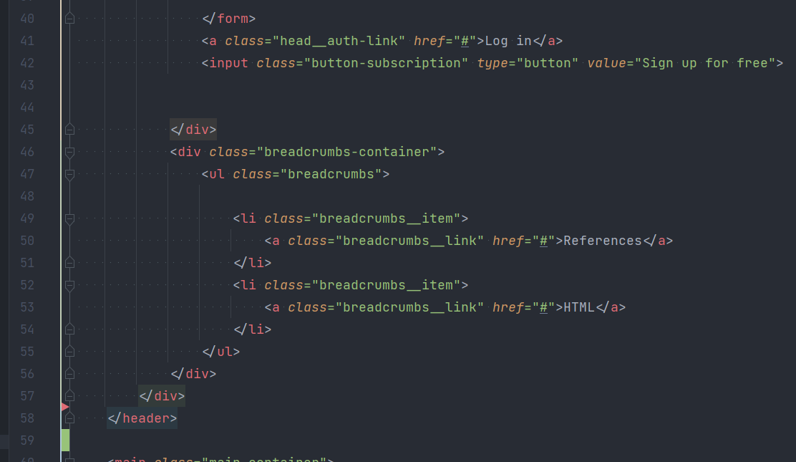
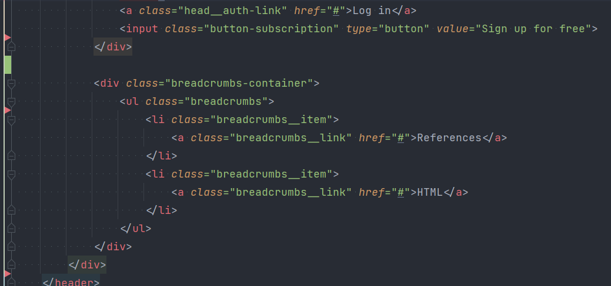

1. index.html должен лежать в корне сайта. Не стоит класть его в другие директории
2. Имена файлов должны начинаться только латиницей + оно быть в kebab-case. В данном случае, такое разделение избыточно.
   Можно было всё поместить в файл footer.css. Достаточно было чтобы классы были объеденины каким-то минимальным блоком,
   в данном случае это footer, ну или footer-logo. Более того, некоторые файлы пустые. Это относится ко всем остальным
   файлам

   ps. Такое подробное разбитие будет уместно при работе с фреймворками, которые как раз под это и заточены.
   
3. Много классов в html, которые добавлены, но никак не используются и для бэма не нужны. Например, sticky-container,
   header и тп
4. Есть небольшие проблемы с форматированием кода: лишние переносы строки. Обычно перенос строки ставится между двумя
   независимыми блоками. Фикс незначительный, но значительно улучшает читаемость кода.

   До
   
   После
   
